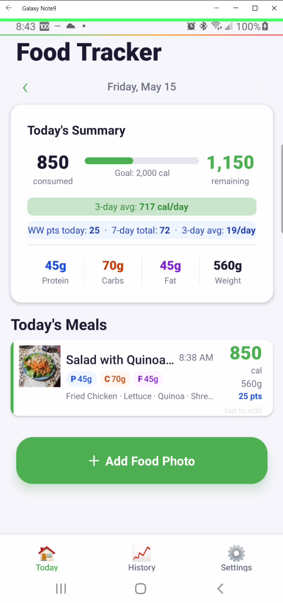
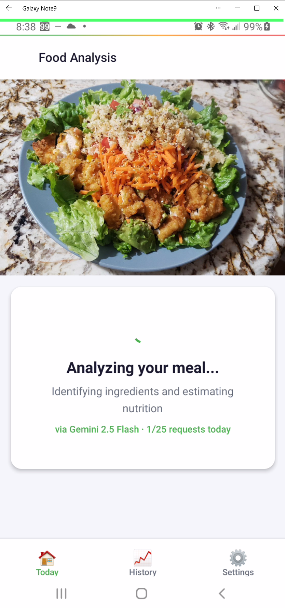
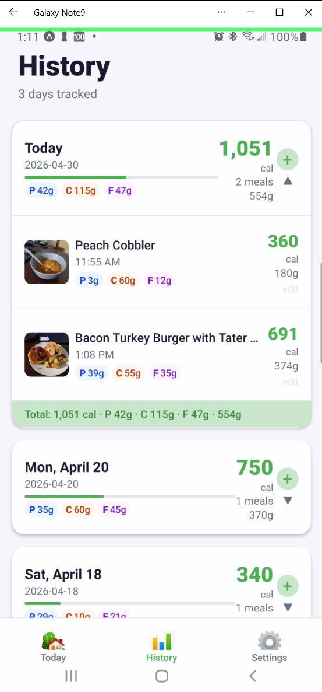
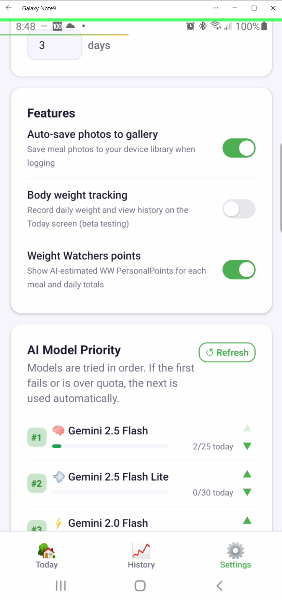
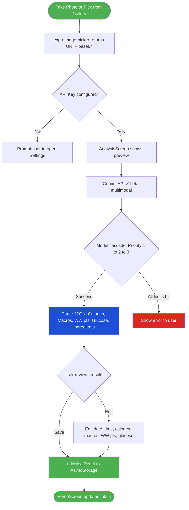

<div align="center">


# Food Tracker AI

**Snap a photo. Get instant nutrition facts. Powered by Google Gemini.**

[](https://github.com/masterq1/foodtracker-ai/releases)
[](https://github.com/masterq1/foodtracker-ai)
[](https://expo.dev)
[](https://reactnative.dev)
[](https://aistudio.google.com)
[](LICENSE)

</div>

---

## Overview

Food Tracker AI is a mobile app that turns your phone camera into a nutrition expert. Point it at any meal, and Google Gemini identifies every ingredient and returns a full macro breakdown — calories, protein, carbs, fat, estimated blood glucose impact, and Weight Watchers PersonalPoints — in seconds. All data lives locally on your device with no account required.

---

## Screenshots

<div align="center">
<table>
  <tr>
    <td align="center"><b>Today's Summary</b></td>
    <td align="center"><b>AI Analysis</b></td>
    <td align="center"><b>Meal History</b></td>
    <td align="center"><b>Settings</b></td>
  </tr>
  <tr>
    <td></td>
    <td></td>
    <td></td>
    <td></td>
  </tr>
</table>
</div>


---

## Features

| | Feature | Details |
|---|---|---|
| 📸 | **AI Photo Analysis** | Take a photo or pick from your gallery — Gemini identifies the dish and every ingredient |
| 🧠 | **Model Cascade** | 3-slot configurable priority queue; automatically falls back when a model hits its daily free-tier limit |
| 🏋️ | **WW Points** | AI estimates Weight Watchers PersonalPoints per meal; today's total + 7-day total + N-day average |
| 📈 | **Glucose Impact** | Estimated post-meal blood glucose rise (mg/dL) per meal |
| ✏️ | **Full Editing** | Edit food name, date, time, calories, weight, macros, WW points, glucose, and ingredients |
| 📅 | **Date Navigation** | Browse and log meals for any past date with ‹ / › arrows |
| 📊 | **History** | Collapsible day-by-day history with calorie bars, macro breakdown, and body weight badges |
| ⚖️ | **Body Weight Log** | Optional daily weigh-in with rolling average (beta) |
| 🖼️ | **Sample Photos** | Generate an AI food photo for any manual meal entry |
| 📴 | **Offline-First** | All data in AsyncStorage — no server, no account, no cloud sync |

---

## How It Works



---

## Tech Stack

<div align="center">

| Layer | Technology | Version |
|---|---|---|
|  | React Native + Expo | 0.81 / ~54.0 |
|  | Bottom Tabs + Stack Navigator | v7 |
|  | Local key-value persistence | 2.2 |
|  | Persistent image storage | ~19 |
|  | Camera + gallery picker | ~17 |
|  | Multimodal food analysis | v1beta |
|  | Android nav bar insets | ~5.6 |

</div>

---

## AI Models

The app uses Google Gemini on the **free tier**. Configure three priority slots in Settings — the app cascades automatically when a model hits its daily limit.

| Model | Daily Free Limit | Badge | Best Slot |
|---|---|---|---|
| `gemini-2.0-flash` | **1,500 req/day** | ⚡ Flash | #1 — primary workhorse |
| `gemini-flash-latest` | **1,500 req/day** | 🔥 Latest | alternate #1 |
| `gemini-2.5-flash-lite` | **30 req/day** | 💨 Lite | #2 — smart fallback |
| `gemini-2.5-flash` | **25 req/day** | 🧠 Thinking | #3 — highest accuracy |
| `gemini-3-flash-preview` | **25 req/day** | 🚀 Preview | experimental |

---

## Project Structure

```
foodtracker-ai/
├── App.js                          # Root — SafeAreaProvider wrapper
├── app.json                        # Expo config (permissions, version, icons)
├── src/
│   ├── navigation/
│   │   └── AppNavigator.js         # Tab + stack router, safe-area-aware tab bar
│   ├── screens/
│   │   ├── HomeScreen.js           # Daily summary, date nav, meal list, FAB
│   │   ├── AnalysisScreen.js       # AI result view + full edit before save
│   │   ├── EditMealScreen.js       # Manual entry / meal editor + re-analysis
│   │   ├── HistoryScreen.js        # Collapsible day history with totals
│   │   ├── MealDetailScreen.js     # Read-only meal detail view
│   │   └── SettingsScreen.js       # API key, goals, toggles, model priority
│   ├── services/
│   │   ├── geminiApi.js            # Gemini API calls, model cascade, retry logic
│   │   └── storage.js              # AsyncStorage helpers, settings, weight log
│   └── theme/
│       └── index.js                # Colors, spacing, font sizes, border radii
└── assets/                         # App icon (1024×1024), adaptive icon, splash
```

---

## Data Schema

Each saved meal contains:

```jsonc
{
  "id": 1746123456789,
  "timestamp": "2025-05-01T12:34:00.000Z",
  "foodName": "Grilled Chicken Salad",
  "totalCalories": 420,
  "totalWeightGrams": 380,
  "proteinGrams": 38,
  "carbsGrams": 22,
  "fatGrams": 18,
  "glucoseRiseMgDl": 35,        // estimated post-meal BG rise
  "wwPoints": 8,                 // AI-estimated WW PersonalPoints
  "ingredients": [
    { "name": "Grilled chicken breast", "amount": "150g" },
    { "name": "Romaine lettuce",        "amount": "120g" }
  ],
  "confidence": "high",          // "high" | "medium" | "low"
  "notes": "",
  "imageUri": "file:///data/.../meals/meal_1746123456789.jpg",
  "analyzedByModel": "gemini-2.0-flash"
}
```

**AsyncStorage key layout:**

| Key | Value |
|---|---|
| `@food_tracker_settings` | API key, calorie goal, averageDays, feature toggles |
| `@meals_YYYY-MM-DD` | Array of meal objects for that date |
| `@weight_YYYY-MM-DD` | Single float — daily body weight reading |
| `@model_priority` | `[modelId, modelId, modelId]` — 3-slot order |
| `@model_usage_<modelId>` | `{ date, count }` — resets daily |

---

## Getting Started

### Prerequisites

- [Node.js](https://nodejs.org/) 18+
- [Expo Go](https://expo.dev/client) on your Android device
- A free [Google AI Studio](https://aistudio.google.com/) API key

### Install & Run

```bash
git clone https://github.com/masterq1/foodtracker-ai.git
cd foodtracker-ai
npm install
npx expo start
```

Scan the QR code with **Expo Go** on your Android device.

### First-Time Setup

1. Tap **Settings** → paste your Google Gemini API key → tap **Save Key**
2. Set your **Daily Calorie Goal** (default: 2,000 kcal)
3. Optionally enable **Weight Watchers points** and **Body Weight** tracking
4. Adjust the **AI Model Priority** to taste

---

## Building an APK

No EAS account needed — builds run fully locally.

```bash
# 1. Bundle the JavaScript
npx expo export --platform android
cp dist/_expo/static/js/android/*.hbc android/app/src/main/assets/index.android.bundle

# 2. Build the APK
cd android
ANDROID_SDK_ROOT="$HOME/AppData/Local/Android/Sdk" \
ANDROID_HOME="$HOME/AppData/Local/Android/Sdk" \
./gradlew assembleDebug
```

Output: `android/app/build/outputs/apk/debug/app-debug.apk`

---

## Changelog

### v1.1
- ✅ AI estimates **Weight Watchers PersonalPoints** per meal
- ✅ Settings toggle for WW tracking; home screen shows today's total + 7-day total + N-day avg
- ✅ History screen shows per-day WW totals
- ✅ **Full editing** in AnalysisScreen: date, time, calories, weight, macros, WW pts, glucose
- ✅ **WW points and Glucose Impact** editable in EditMealScreen
- ✅ Default calorie average window changed to 3 days

### v1.0
- ✅ AI photo analysis via Google Gemini with model cascade
- ✅ Manual meal entry with AI description analysis
- ✅ AI-generated sample food photos
- ✅ Date navigation, collapsible history, body weight log (beta)
- ✅ Configurable 3-slot AI model priority with daily usage bars

---

<div align="center">

**Food Tracker AI** &nbsp;·&nbsp; Built with [React Native](https://reactnative.dev) + [Expo](https://expo.dev) &nbsp;·&nbsp; Powered by [Google Gemini](https://aistudio.google.com)

</div>
